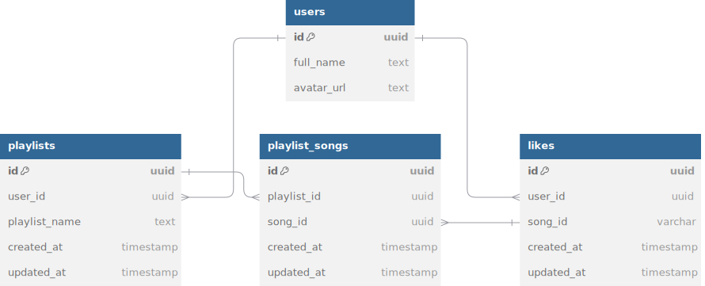

<div>
  <div align="center" style="display: flex; align-items: center; justify-content: center;">
    
  </div>
  <h1 style="vertical-align: middle;">Mine Beats</h1>
  <h3>🎵 A modern music player application built with Next.js and Supabase.</h3>
</div>

<div align="center" style="display: flex; align-items: center; justify-content: center; margin-top: 20px; margin-bottom: 20px;">
  <a href="https://github.com/Dylan-Chambi/mine-beats-music-player/blob/main/LICENSE"></a>
  <a href="https://mine-beats-music-player.vercel.app/" style="margin-left: 10px;"></a>
</div>

<br/>

This project is a showcase of a modern web application built with Next.js, featuring various integrations and optimizations. It is designed to demonstrate my skills in web development and showcase my ability to build a full-fledged web application from scratch. Also it is a music player application that allows users to search for songs, authenticate with their accounts and save their favorite tracks.

## Features 🚀

- **Next.js Framework:** Utilizes the powerful Next.js framework for server-side rendering and static site generation.
- **Vercel Deployment:** Seamless deployment on Vercel with automated CI/CD.
- **Google Fonts Optimization:** Automatic optimization and loading of custom Google Fonts.
- **Modular Architecture:** Organized code structure with reusable components and hooks.
- **Tailwind CSS Styling:** Styling with Tailwind CSS for utility-first design.
- **Zustand State Management:** Lightweight state management with Zustand.
- **Supabase Integration:** Database and authentication integration with Supabase.
- **TypeScript Support:** Strongly typed JavaScript with TypeScript.
- **ESLint and Prettier:** Linting and formatting with ESLint and Prettier.
- **Responsive Design:** Mobile-first responsive design with media queries.
- **Live Demo:** Interactive demo deployed on Vercel [Mine Beats Music Player](https://mine-beats-music-player.vercel.app/).

## Live Demo 🌐

[](https://mine-beats-music-player.vercel.app/)

## Screenshots 📸

### Home Page


### Search Page


### Favorites Page


### Login Modal


### Entity-Relationship Diagram (ERD)



## Tech Stack 💻

- [Next.js](https://nextjs.org/) – Framework
- [React](https://reactjs.org/) – Library
- [Vercel](https://vercel.com/) – Deployment Platform
- [Tailwind CSS](https://tailwindcss.com/) – Utility-first CSS framework
- [Zustand](https://zustand.surge.sh/) – State management
- [Supabase](https://supabase.io/) – Database and authentication
- [TypeScript](https://www.typescriptlang.org/) – Typed JavaScript
- [Google Fonts](https://fonts.google.com/) – Custom fonts
- [ESLint](https://eslint.org/) – Linting tool
- [Prettier](https://prettier.io/) – Code formatter

## Getting Started 🏁

### Prerequisites ✔️

Here's what you need to get started with this project:

- [Node.js](https://nodejs.org/) and npm installed
- [Vercel CLI](https://vercel.com/download) for deployment
- [Supabase](https://supabase.io/) account for database/auth integration
- Recommended: [VSCode](https://code.visualstudio.com/) with relevant extensions

### Installation Steps 🛠️

#### **1. Clone the repository**

```
git clone https://github.com/Dylan-Chambi/mine-beats-music-player.git
cd mine-beats-music-player
```

#### **2. Install dependencies**

```
npm install
```

#### **3. Create and set up a Supabase project**

1. Create a new project on [Supabase](https://app.supabase.io/).
2. Set up a new table with the schema provided in [Supabase Database Schema](./database/supabase-schema.psql).
3. Create a new role with the permissions provided in [Supabase Role Permissions](./database/supabase-role.sql).
4. Create a new API key with the permissions provided in [Supabase API Key Permissions](./database/supabase-apikey.sql).
5. Set up authentication with the provider of your choice (e.g., Google, GitHub).

#### **4. Set up environment variables**

Create a `.env.local` file in the root directory and add the following environment variables:

```env
NEXT_PUBLIC_SUPABASE_URL=your-supabase-url
NEXT_PUBLIC_SUPABASE_ANON_KEY=your-supabase-anon-key
```

You can find these values in your [Supabase dashboard](https://app.supabase.io/).

#### **5. Set up Supabase Typescrpt Types**

Run the following command to generate TypeScript types for Supabase:

1. Install the Supabase CLI:

```bash
npm i supabase@">=1.8.1" --save-dev
```

2. Login to Supabase:

```bash
npx supabase login
```

3. Initialize the Supabase project:

```bash
npx supabase init
```

4. Generate TypeScript types:

```bash
npx supabase gen types --lang=typescript --project-id "$PROJECT_REF" --schema public > database.types.ts
```

#### **5. Run the development server**

```
npm run dev
```

Open [http://localhost:3000](http://localhost:3000) with your browser to see the result.

## Project Structure 📂

```

src
├───app
│ ├───(site)
│ ├───actions
│ ├───auth
│ ├───favorites
│ ├───fonts.ts
│ ├───globals.css
│ ├───layout.tsx
│ ├───playlists
│ ├───providers
│ ├───recent
│ └───search
├───components
│ ├───AuthButtons.tsx
│ ├───Button.tsx
│ ├───ControlButtons.tsx
│ └───Header.tsx
├───hooks
├───types
└───utils

```

## Deployment 🚀

The easiest way to deploy your Next.js app is to use the [Vercel Platform](https://vercel.com/new?utm_medium=default-template&filter=next.js&utm_source=create-next-app&utm_campaign=create-next-app-readme) from the creators of Next.js.

Check out our [Next.js deployment documentation](https://nextjs.org/docs/deployment) for more details.

## License 📝

This project is licensed under the AGPLv3 License - see the [LICENSE](LICENSE) file for details.

## Author 👨‍💻

<p align="center">
  <a href="https://github.com/Dylan-Chambi">
  
  <p align="center">Dylan Chambi</p>
  </a>
</p>
